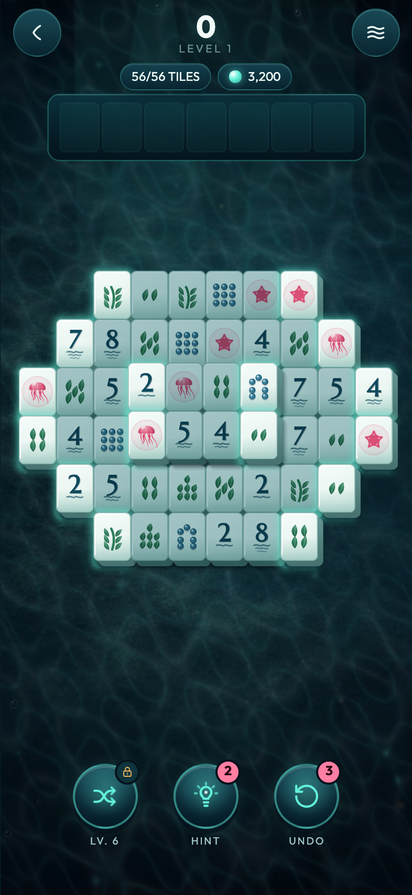
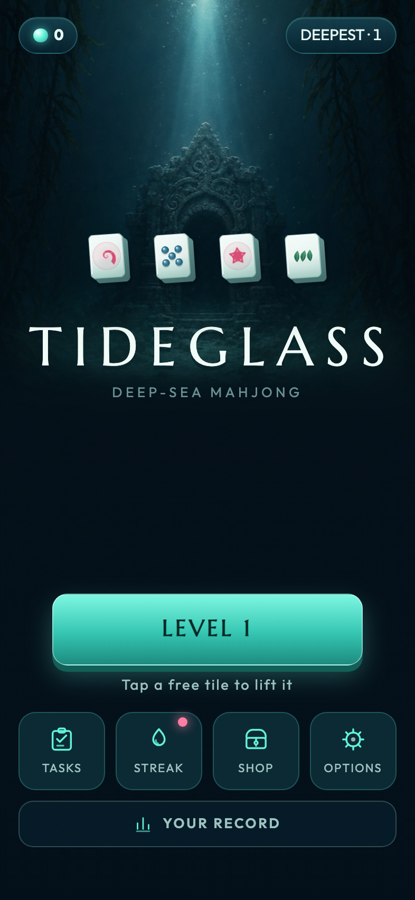

# TIDEGLASS

A drowned mahjong set, worn to sea glass.

<p align="center">
  
  
</p>

Mahjong Solitaire with a **collection tray**. Tap any tile that is not covered
and has a free left or right side and it lifts into the tray at the top of the
screen. Two of the same tile in the tray shatter and score, and matching quickly
carries a combo. Fill every tray slot without a match and the level ends.

Portrait, PixiJS 8, WebGPU-first with an automatic WebGL2 fallback.
`@series-inc/rundot-game-sdk` 5.24, Vite 6, React 19 for the UI shell only.

**Three painted images ship** — a sunken shrine, a silted seabed, and a lantern
jellyfish, all generated with the `codex-image-gen` skill and listed in
`src/assets/art/` — plus one music track ("River Pipa", `src/assets/audio/`,
streamed and looped at a deliberately low mix level). Everything else is still
drawn by the game's own code: every tile face, glyph, particle, panel and sound
effect, plus the store thumbnail, which composites the painted plates with real
tile faces so it can never drift from what the game looks like.

## Running it

```sh
npm run dev              # http://localhost:5183
npm run dev:playground   # + RUN Playground (real services, real purchases)
```

## Verifying it

```sh
npm run check        # format, lint, simulate, public audit, both builds
npm run simulate     # the correctness gates (fast)
npm run balance      # the win-rate sweep across the level ladder
npm run visual-qa    # headless screenshots + behaviour gates at four viewports
npm run thumbnail    # re-render public/thumbnail.jpg from the game's own art
```

`npm run simulate` is the one that matters. The failure this game is most
exposed to is a board that **cannot be finished**, and that is invisible on
screen — an unwinnable board looks exactly like a hard one until a player has
wasted ten minutes on it. So every dealt board and every shuffled board is
replayed through the real session, tap by legal tap, until it is empty.

## How it is put together

| Path | What lives there |
| --- | --- |
| `src/game/mahjong/` | The rules. No Pixi, no React, no store, no clock — which is why the simulation can prove them. |
| `src/game/art/` | Generated art. `glyphs.ts` draws the 36 faces, `tileArt.ts` bakes them into textures, `backdrop.ts` makes the caustics, bubbles and rings. |
| `src/assets/art/` | The three painted plates the game ships, and the music in `src/assets/audio/`. |
| `src/game/scene/` | Presentation: sprites, motion, input. Asks the engine what anything means. |
| `src/game/gameController.ts` | The only file that knows the engine, the scene, the store and the platform at once. |
| `src/systems/` | Save, economy, daily systems, ads, commerce, LiveOps. |
| `src/ui/` | The React shell: menu, HUD, overlays, subscreens. |

### Three things that are load-bearing

1. **Boards are solvable by construction.** The generator plays the board
   backwards — it repeatedly pops slots that are free in the current state and
   records the order, which is by definition a legal forward clearing order.
   Shuffle uses the same routine, with the tiles already in the tray modelled as
   `carriedKinds` so the tray can always be emptied.

2. **The tray is the difficulty dial.** Board size and kind variety turned out
   not to control difficulty at all: a big loose board hands the player *more*
   free tiles, and any board past ~120 tiles is forced to use nearly every kind
   anyway. Tray capacity narrows from 7 to 5 across the ladder, and the layout
   order in `levels.ts` is sorted by **measured** win rate, not by tile count.
   Re-run `npm run balance` after touching a layout.

3. **Painted plates must be loaded through Pixi's `Assets`, not just the
   browser.** `Texture.from(url)` is synchronous and returns an empty texture
   for anything `Assets` has not loaded; the board sizes its seabed the instant
   the sprite is made, so an unloaded texture means a permanently mis-scaled
   backdrop rather than a late one. `assets/preload.ts` loads it before the
   board can exist.

4. **Texture resolution must be passed at construction.** Assigning
   `texture.source.resolution` after `Texture.from(canvas)` silently does
   nothing. That bug rendered every tile at 2x its design size, so each tile
   covered its neighbours and swallowed their taps while still looking
   plausible. `visual-qa` now asks the scene's `hitTest` whether each tap will
   land on the tile it was aimed at.

## Monetization

Two channels, both real, both fail-closed when the host cannot verify them.

**Run Bits** — three durable products in `rundot/shop.config.json`: the Lantern
Kit (179 RB, one extra hint/undo/shuffle at the start of every level), Still
Water (299 RB, removes the between-levels interstitial), and the Deepwater
Bundle (429 RB, both plus the Abyssal tile finish).

**Ads** — two opt-in rewarded videos (double the pearls on a cleared level;
Second Wind returns three tiles after a full tray) and one capped interstitial
between levels, never in a player's first session and never for an owner of
Still Water or the bundle.

The promise the whole model is built around: **no purchase and no ad ever
changes a board, a tile, a layout, a score, or how hard a level is.** Boards are
dealt solvable for everyone, and every tool is earnable with pearls by playing.

Prices are documented launch hypotheses, not proven facts. The rationale and the
rollback signals are in `src/systems/monetization/config.ts`.

## Status

Not yet `rundot init`-ed. `gameId` in `game.config.prod.json` and
`src/config/platform.ts` is still `REPLACE_WITH_RUN_GAME_ID`, so shop, ad and
entitlement surfaces fail closed and hide themselves. Everything else — the
board, progression, pearls, tools, daily systems, saves — is fully playable
without a RUN host.

Licensed under `LICENSE.md`.
